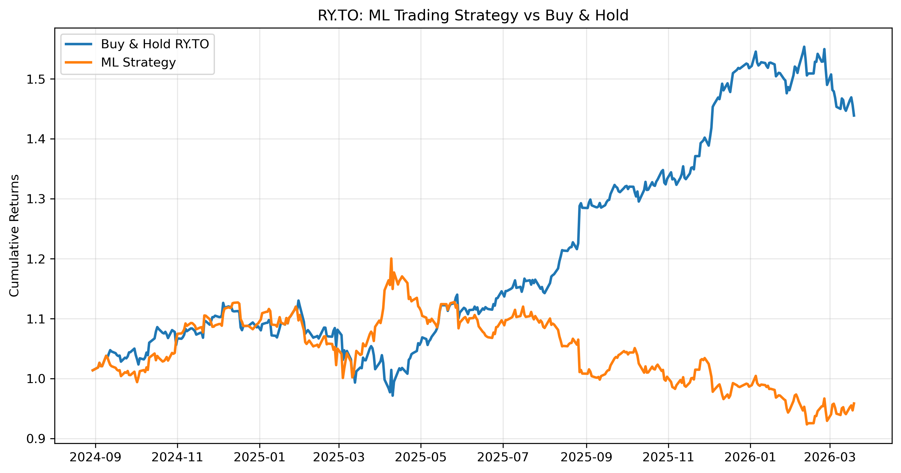
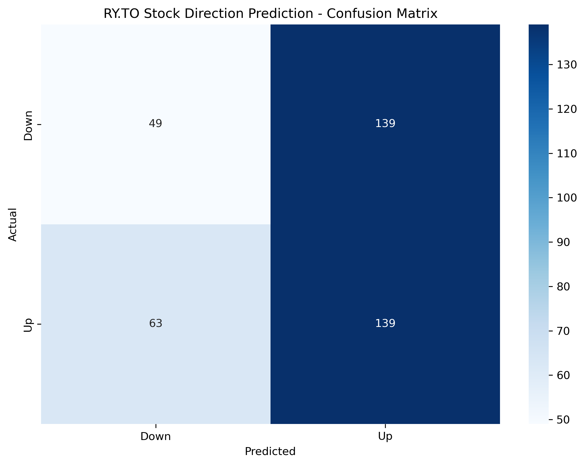

# RBC Stock Direction Predictor

Machine Learning model predicting Royal Bank of Canada (RY.TO) daily stock movements.




## What I Built

**Predicts**: RY.TO stock goes UP (1) or DOWN (-1) next trading day

**Data**: 6+ years daily OHLCV from Yahoo Finance (2020-2026)
- 1,560 trading days  
- Features: Open-Close spread, High-Low range

**Model**: K-Nearest Neighbors (KNN)
- GridSearchCV optimized (K=15)
- 5-fold cross-validation
- **Test accuracy: 48.21%**
- **Train accuracy: 63.00%**

## Trading Strategy Results

| Metric | ML Strategy | Buy & Hold |
|--------|-------------|------------|
| **Return** | **-2.36%** | **38.23%** |
| **Test Accuracy** | **48.21%** | - |

## Tech Stack

Python | pandas | scikit-learn | yfinance | matplotlib | seaborn


## Files in Repo
- RBC_stock.ipynb (Full analysis)
- backtest_ry.png (Strategy vs Buy & Hold)
- confusion_matrix_ry.png (Model performance)
- ry_predictions.csv (390 predictions)


## Run It
```bash
pip install yfinance pandas scikit-learn matplotlib seaborn
jupyter notebook RBC_stock.ipynb 
```

## Skills Demonstrated
- Financial data processing (yfinance MultiIndex)
- ML model optimization (GridSearchCV)
- Trading strategy backtesting
- Production visualizations

### Pranish Biswakarma 
